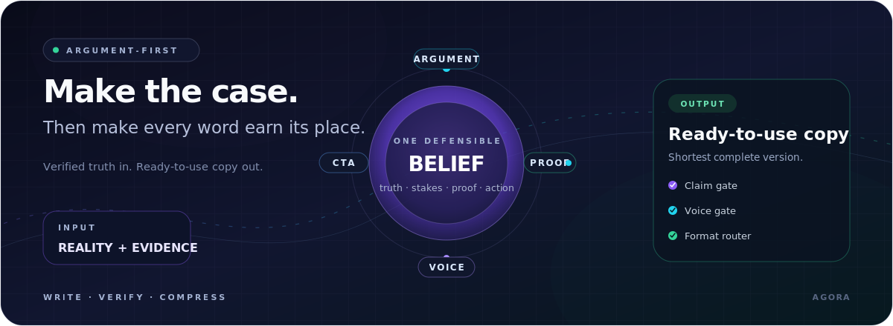

<p align="center">
  
</p>

<h1 align="center">Maestro: Agora</h1>

<p align="center"><strong>Verified truth, conducted into copy.</strong></p>

<p align="center">
  <a href="https://github.com/mbanderas/maestro-agora/actions/workflows/validate.yml"></a>
  <a href="https://www.npmjs.com/package/@maestrofrontier/agora"></a>
  <a href="LICENSE"></a>
</p>

Agora is a portable Agent Skill for marketing, sales, editorial, interface, outreach, and spoken copy. It gives an AI agent a research-backed argument method, a strict claim gate, channel-aware brevity rules, and written GEO/AEO guidance—without treating a persuasive framework as permission to invent the proof.

Give it product truth, evidence, constraints, and one desired action. The skill instructs the agent to return the shortest complete, ready-to-use draft first.

> **One suite: fuse the answer, make the case, guard the spend.**
>
> - **[Maestro Frontier](https://github.com/mbanderas/maestro)** — Fuses the model CLIs you already run into one judged, grounded answer.
> - **[Maestro Agora](https://github.com/mbanderas/maestro-agora)** — Turns verified product truth into concise, argument-first copy without inventing the proof.
> - **[Maestro CostGuard](https://github.com/mbanderas/costguard)** — Audits CI and cloud infrastructure for cost leaks and shows what to fix.

## Install

One command installs Agora for the shared Agent Skills path and Claude Code:

```sh
npx -y @maestrofrontier/agora
```

The default user install writes the same reviewed skill to:

- `~/.agents/skills/agora` for Codex and Agent Skills-compatible tools.
- `~/.claude/skills/agora` for Claude Code.

Choose a native target or project-local scope when you need one:

```sh
npx -y @maestrofrontier/agora --target cursor --scope project
npx -y @maestrofrontier/agora --target codex,claude --scope user
npx -y @maestrofrontier/agora --target universal --dry-run
```

Supported targets are `universal`, `shared`, `codex`, `claude`, `cursor`, `gemini`, `copilot`, and `windsurf`. Add `--force` only when you intend to replace a different copy at the exact `agora` destination.

### Native plugin install

Claude Code:

```text
/plugin marketplace add mbanderas/maestro-agora
/plugin install maestro-agora@maestro-agora
```

Codex CLI:

```sh
codex plugin marketplace add mbanderas/maestro-agora
codex plugin add maestro-agora@maestro-agora
```

The npm installer is the broadest route across IDEs. The native plugin commands install the repository's matching Claude or Codex manifest.

## Use Agora

Invoke the skill directly, then provide the facts it may use:

```text
/agora Rewrite this upgrade screen. Keep one CTA. Use only these verified facts: ...
```

In Codex, `$agora` and the skills picker can also select the installed skill. Other hosts may expose skills through their own picker or mention syntax; asking the agent to “use the agora skill” remains portable.

Agora activates for writing, rewriting, shortening, critiquing, and planning:

- Marketing and sales copy, CTAs, and microcopy.
- Landing, product, and comparison pages.
- Email, direct outreach, ads, and social posts.
- Mobile onboarding, upgrade, and paywall screens.
- Editorial content.
- Audio and video scripts plus titles, descriptions, transcripts, captions, show notes, and companion pages.

## What the skill enforces

Agora silently routes each asset as indexable public, public non-indexable written, private written, spoken-only, or hybrid. It then applies only the controls that fit the surface.

- **Argument before ornament.** Build one defensible belief shift, one decision path, and one primary action.
- **Proof beside the claim.** Preserve source, scope, date, qualification, and material limitations.
- **Shortest complete draft.** Remove repetition before evidence, legal meaning, accessibility, or next-step clarity.
- **Human voice controls.** Cut stock openings, vague hype, fabricated texture, template residue, and decorative recaps.
- **Claim gate.** Narrow, omit, or flag unsupported claims instead of supplying missing features, prices, routes, urgency, scarcity, testimonials, or results.
- **Ready copy first.** Return one usable draft without exposing private reasoning or producing near-duplicate variants unless asked.

The skill improves process discipline; it does not replace source review, legal review, or final human verification.

## Written GEO/AEO boundaries

For written assets, Agora treats generative-engine optimization and answer-engine optimization as clarity and evidence work: answer the reader's question early, name entities and scope, keep proof adjacent to claims, expose provenance, and make useful passages self-contained.

For indexable public pages, it can also flag technical publication checks such as crawlability, canonical consistency, structured data, and sitemap inclusion. These practices can improve eligibility and citability; they cannot promise retrieval, selection, quotation, citation, ranking, recommendation, referral, conversion, or revenue.

Spoken-only delivery skips GEO/AEO formatting. Published titles, descriptions, transcripts, captions, show notes, and companion pages receive the written treatment separately.

## How Agora works

<p align="center">
  
</p>

The public skill stays intentionally small:

```text
skills/agora/
├── SKILL.md
├── agents/
│   └── openai.yaml
└── references/
    └── agora-marketing.md
```

`SKILL.md` contains the operating workflow. `references/agora-marketing.md` is the canonical authority for evidence grades, ethical limits, persuasion controls, AI-writing-tell checks, and GEO/AEO boundaries. CiteSurge-specific rules remain isolated to CiteSurge work.

## Verify the package

```sh
npm run check
npx -y @maestrofrontier/agora --dry-run
```

The validation suite checks the strict skill root, plugin manifests, relative links, installer behavior, and the exact npm package allowlist.

## License

[MIT](LICENSE)
