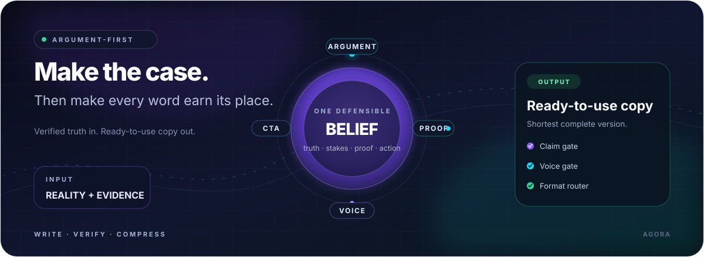

<p align="center">
  
</p>

<h1 align="center">Maestro: Agora</h1>

<p align="center"><strong>Verified truth, conducted into copy.</strong></p>

<p align="center">
  <a href="https://github.com/mbanderas/maestro-agora/actions/workflows/validate.yml"></a>
  <a href="https://www.npmjs.com/package/@maestroagora/agora"></a>
  <a href="LICENSE"></a>
</p>

Words cannot rescue a missing argument. Agora starts with the decision behind the copy.

Give it verified facts, the real audience, and the surface where the copy will live. Agora finds the consequential shift or stake, explains the mechanism that changes it, selects the proof that matters most, and turns that case into channel-native copy. The result can feel urgent, ambitious, reassuring, or direct. It cannot outrun the evidence.

Use Agora for landing pages, ads, company profiles, investor narratives, sales emails, product copy, paywalls, editorial work, interface text, and spoken scripts.

**One suite: fuse the answer, make the case, guard the spend.**

- **[Maestro Frontier](https://github.com/mbanderas/maestro):** Fuses the model CLIs you already run into one judged, grounded answer.
- **[Maestro Agora](https://github.com/mbanderas/maestro-agora):** Turns verified product truth into concise, argument-first copy without inventing the proof.
- **[Maestro CostGuard](https://github.com/mbanderas/costguard):** Audits CI and cloud infrastructure for cost leaks and shows what to fix.

## Install

Install Agora across the shared Agent Skills path and Claude Code:

```sh
npx -y @maestroagora/agora
```

The default user install writes the same reviewed skill to:

- `~/.agents/skills/agora` for Codex and Agent Skills-compatible tools.
- `~/.claude/skills/agora` for Claude Code.

Install only the user-level Codex skill:

```sh
npx -y @maestroagora/agora --target codex --scope user
```

Open a new task or restart the host after installation so its skill registry and slash menu reload.

Choose a target or project-local scope when needed:

```sh
npx -y @maestroagora/agora --target cursor --scope project
npx -y @maestroagora/agora --target codex,claude --scope user
npx -y @maestroagora/agora --target universal --dry-run
```

Supported targets are `universal`, `shared`, `codex`, `claude`, `cursor`, `gemini`, `copilot`, and `windsurf`. Add `--force` only when you intend to replace a different copy at the exact `agora` destination.

Update an existing user installation:

```sh
npx -y @maestroagora/agora@latest --target universal --scope user --force
```

### Native plugin install

Claude Code:

```text
/plugin marketplace add mbanderas/maestro-agora
/plugin install maestro-agora@maestro-agora
```

Codex CLI:

```sh
codex plugin marketplace add mbanderas/maestro-agora
codex plugin add maestro-agora@maestro-agora
```

The npm installer is the broadest route across IDEs. Native plugin commands use the matching Claude or Codex manifest from this repository.

## Use Agora

Invoke the skill directly and provide the facts it may use:

```text
/agora Rewrite this upgrade screen. Make the blocked action matter, state the plan difference clearly, and use one supported CTA.
```

Choose a mode when you want to override inference:

```text
/agora position Turn these verified facts into a 35-word company profile.
/agora sell Build a homepage hero around the strongest buyer stake this evidence supports.
/agora invest Write a one-paragraph capital case from timing, mechanism, proof, and use of funds.
/agora inform Explain this research finding for a public article.
/agora transact Rewrite this confirmation so the state and next action are unmistakable.
```

In Codex, `$agora` and the skills picker can also select the installed skill. Other hosts may expose skills through a picker or mention syntax. Asking the agent to "use the Agora skill" remains portable.

## How the persuasion engine works

Agora reasons through a variable-depth path:

```text
situation -> stake -> criterion when useful -> mechanism -> proof -> destination belief -> next step
```

That path stays internal. It is not a paragraph template.

- Very short copy pairs the strongest market shift, felt stake, or live consequence with the strongest verified differentiator.
- Medium copy adds the mechanism and the proof clue or qualifier that matters most.
- Long copy expands only when another fact resolves a real objection or expensive uncertainty.

This keeps a 35-word profile from sounding like a compressed pitch deck. It also keeps a full investor narrative from collapsing into a feature list.

### Mode routing

| Mode | Use or infer it for |
|---|---|
| `POSITION` | Company profiles, directories, About copy, website summaries, category narratives, and objective descriptions |
| `SELL` | Marketing, sales, ads, landing pages, product pages, outreach, upgrades, and paywalls |
| `INVEST` | Actual funding, capital-allocation, diligence, investor-pitch, and fundraising work |
| `INFORM` | Editorial and educational work |
| `TRANSACT` | Buttons, confirmations, alerts, forms, and utility microcopy |
| `VOICE` | A modifier on any of the above, not a job of its own. `--voice <name>` writes in a measured author profile |

`POSITION` is the default for descriptive company profiles, even when investors may read them. Agora makes relevance emerge from the shift, mechanism, wedge, and proof. It does not insert phrases such as "for investors" or "merits evaluation."

### Proof salience

Agora ranks facts by decision relevance, differentiation, verifiability, specificity, compression value, and omission risk.

It keeps the facts that change the decision. A measured outcome may outrank five minor features. A named list of supported engines may be the proof when scope is the decision. Diagnostic enumeration stays. Decorative feature volume goes.

### Emotion without invention

Agora chooses one dominant emotional job, such as tension, relief, control, ambition, belonging, or curiosity. It expresses that feeling through a real situation, a supportable consequence, and available agency.

It never manufactures fear, urgency, scarcity, loss, social proof, intimacy, or certainty. Emotion makes the facts consequential. It does not replace them.

## Surface routing

Mode and surface are separate decisions.

| Surface | Treatment |
|---|---|
| `INDEXABLE_PUBLIC` | Public claim review, human-voice and GEO/AEO passes, then relevant technical publication checks |
| `PUBLIC_NON_INDEXABLE_WRITTEN` | Public claim review, written evidence structure, and human-voice pass; no crawl or index checks |
| `WRITTEN_PRIVATE` | Proof fidelity, channel fit, concrete meaning, and human-voice pass |
| `SPOKEN_ONLY` | Proof review, cadence, breath, timing, and listener comprehension; no GEO/AEO formatting |
| `HYBRID` | Spoken delivery and each written derivative are routed separately |

Published titles, descriptions, transcripts, captions, show notes, and companion pages receive written treatment. Spoken-only delivery stays free of search-format scaffolding.

## Silent safeguards

Agora builds the argument before it runs publication and style checks. Those checks remain invisible unless the delivered copy would otherwise be misleading, legally unusable, or operationally unshippable.

- Unsupported claims are narrowed or removed, not buried under a disclaimer.
- Facts, inference, interpretation, aspiration, and promises remain distinct.
- GEO/AEO improves written clarity and evidence structure after the argument exists.
- Human-voice cleanup removes prompt leakage, canned templates, generic significance tails, and smart quotes. A separate hard invariant bans U+2014 from the entire generated response, including copied text and commentary, with a mandatory final character scan.
- Necessary factual series survive the cleanup.
- One ready-to-use result comes first. Near-duplicate variants appear only when requested.

The skill improves writing discipline. It does not replace source review, legal review, or final human judgment.

## Written GEO/AEO boundaries

For written assets, Agora answers the reader's question early when the format calls for it, names entities and scope, keeps proof beside claims, exposes real provenance, and builds useful passages that remain accurate when quoted alone.

For indexable public pages, Agora can also flag relevant crawlability, canonical, sitemap, metadata, structured-data, accessibility, and delivery checks. These practices can improve eligibility and citability. They cannot promise retrieval, selection, quotation, citation, ranking, recommendation, referral, conversion, or revenue.

## AI visibility after publication

Agora turns verified facts into argument-first copy. It does not measure whether AI answers mention your brand or cite your sources. [CiteSurge](https://CiteSurge.com) is a separate platform for citability engineering and cross-engine AI visibility tracking.

## How Agora works

<p align="center">
  
</p>

The skill itself stays intentionally small:

```text
skills/agora/
├── SKILL.md
├── agents/
│   └── openai.yaml
└── references/
    ├── agora-craft.md
    ├── agora-marketing.md
    └── agora-voice.md
```

`SKILL.md` is the concise operating contract. `references/agora-marketing.md` holds the original doctrine, research evidence grades, ethical limits, channel rules, AI-writing-tell controls, GEO/AEO boundaries, examples, and evaluation guidance.

`references/agora-craft.md` is loaded only when the task needs it. It covers four narrower domains: headlines and titles across each publishing surface, awareness and sophistication staging with its routing table, emotion written from a fact set that contains no outcome data, and prose rhythm. Every rule in it carries an evidence grade and a stated failure condition, every number is either sourced or labelled a governance default, and the two cadence conflicts the research left open are recorded rather than resolved.

`references/agora-voice.md` governs `VOICE`, the one mode that modifies another rather than replacing it. `--voice <name>` loads a measured author profile on top of whichever job was already selected, and `voice build`, `voice list`, and `voice check` manage the profiles themselves. A profile is measured rather than described: it records sentence and paragraph distributions, function words, punctuation, openings, and stance, states plainly what the corpus was too small to measure, and refuses certification below 5,000 clean author-controlled words.

Profiles are stored at `~/.agora/voices/`, deliberately outside the skill directory, because the documented update path replaces that directory and would destroy them. Voice enters at level 6 of the conflict hierarchy: it never licenses an unsupported claim, never overrides required or legal phrasing, and never overrides the em-dash ban. It carries exactly one exception, written down because the alternative is a gate that strips the voice it was loaded to keep: a profile's measured owned-vocabulary list suppresses the generic AI-vocabulary ban for those specific words only. Building or applying a third-party profile for publication under that person's name is refused.

### Building a voice profile

Measurement is computed by a shipped engine, not estimated by the model, because a model asked to describe an author's voice writes flattery:

```sh
npx -p @maestroagora/agora agora-voice build --name house \
  --register blog --from ./posts \
  --register email --from ./letters

npx -p @maestroagora/agora agora-voice list
npx -p @maestroagora/agora agora-voice check --voice house ./draft.md
```

The engine reads Markdown, plain text, and HTML from files, directories, and URLs. It refuses binary document formats by name rather than extracting them partially, because every admission threshold counts clean author-controlled words and a partial extraction would move all of them silently. Quotations, code, tables, signatures, front matter, and headings are stripped before anything is counted, and the profile records what the cleaning removed.

It measures nine feature families: sentence length with percentiles and binned shape, clause structure as a labelled conjunction proxy, function words, punctuation, paragraph shape, lexical diversity by moving-window and decay-based measures, person and stance, sentence openings, and contraction rate scoped to contexts where both forms were grammatical. Raw type-token ratio is withheld by rule, since it falls mechanically as texts grow. Anything the corpus cannot support is written as insufficient data.

Four admission gates run before a profile is certified: at least 10 independent documents with none above 25 percent of clean tokens, 2,500 clean words across 3 documents before a register earns its own numbers, a two-part feature stability rule, and a heterogeneity stop that offers two profiles rather than averaging two registers into a voice belonging to nobody. Below 5,000 clean words nothing is written at all and the tool reports what the corpus needs.

Once a default profile exists, it applies to every mode. Opt out per request with `--no-voice` or `neutral`, or name a different profile with `--voice <name>`.

## Change record

| Version | What changed |
|---|---|
| 1.3.0 | `VOICE` becomes executable. A deterministic measurement engine ships as the `agora-voice` command: a frozen tokenizer, sentence segmenter, and lexicon; ingestion and cleaning for Markdown, plain text, and HTML from files, directories, and URLs, with binary formats refused by name; nine measured feature families with withheld rather than guessed values; all four corpus admission gates; profile and registry writing under `~/.agora/voices/`; and `voice check` with draft-length bands, register matching, and a phrase-overlap index stored as hashed token runs rather than as corpus text. A default profile now applies to every mode, with `--no-voice` and `neutral` as the opt-outs. Two blind eval cases added for build-from-corpus and the owned-vocabulary-against-tell-gate conflict. Two new references. `references/agora-craft.md` covers headlines and titles per publishing surface, awareness and sophistication staging with its routing table, emotion written from a fact set that carries no outcome data, and prose rhythm. `references/agora-voice.md` adds the `VOICE` modifier: measured author profiles stored outside the skill directory, a refusal floor below 5,000 clean author-controlled words, level-6 placement in the conflict hierarchy, the owned-vocabulary exception to the AI-vocabulary ban, and a refusal for third-party profiling intended for publication under that person's name. The Evidence register gains `Myths this document must never assert`, naming twenty-one high-traffic myths with what may be said instead. Four new applied pairs and six reworked, covering category orientation, superlative against specific, a label that overstates its click, and heading variety across one page. Blind eval corpus grows from 21 cases to 26. Two internal contradictions removed: the two-or-three-sentence passage unit that the same document had already refuted, and an unlabelled numeric threshold in the deterministic invariants. The validator now enumerates files through git's own ignore rules rather than walking the working directory, so scratch that exists only in a working copy no longer decides whether the repository is valid. |
| 1.2.2 | Hard ban on the U+2014 character across the entire response, enforced as an immutable output constraint rather than a final-copy cleanup. |
| 1.2.1 | First-read comprehension gate, specialized-term gate, and CTA standard. Comprehension moved above compression, citability, and differentiation in the conflict hierarchy. |
| 1.2.0 | Blind evaluation corpus with a generation contract, pairwise adjudication, and absolute vetoes. |

Every rule added in 1.3.0 carries an evidence grade and a stated failure condition. Every numeric threshold in the references is either followed by a source link or labelled a governance default in the same sentence. Two conflicts the research left open are recorded rather than resolved.

## Verify the package

```sh
npm run check
npx -y @maestroagora/agora --dry-run
```

The validation suite checks the strict three-file skill root, current behavior and release contracts, plugin metadata, relative links, installer behavior, source-link retention, project-agnostic content, line-ending parity, and the exact npm package allowlist. A committed blind-eval corpus covers known failure modes without passing expected answers or grading rules into generation.

## License

[MIT](LICENSE)
